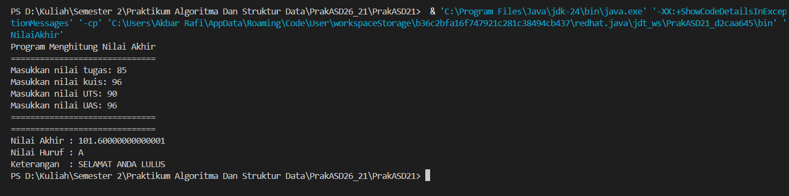
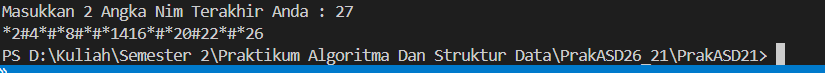
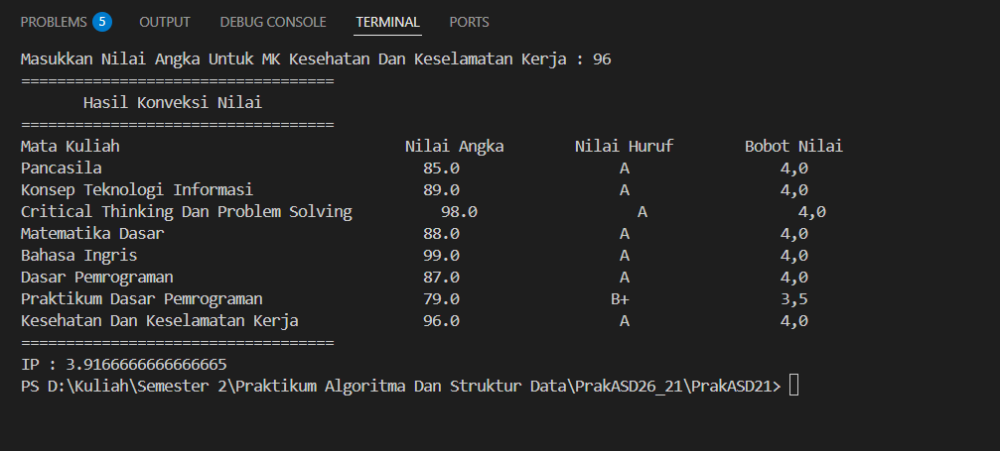
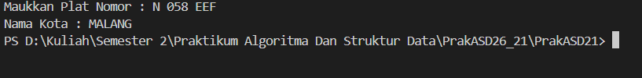
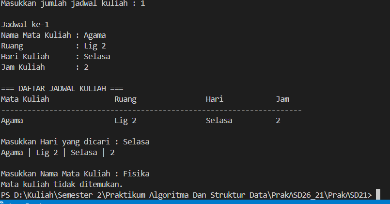

# PrakASD21
Praktikum Algoritma Dan Struktur Data
|--|--|
| NIM |  254107020237|
| Nama |  Muhammad Akbar Raffi Putra Susanto  |
| Kelas | TI - 1F |
| Repository | [link] https://github.com/254107020237-crypto/PrakASD21

# Jobsheet 1 Konsep Dasar Pemrograman

## 1.1 Solusi Pemilihan

Solusi dari penerapan di Pemilihan.java, dan dibawah ini adalah gambar dari hasilnya

## 1.2. Solusi Perulangan

Solusi dari penerapan di Perulangan.java, dan dibawah ini adalah gambar dari hasilnya

## 1.3. Solusi Array

Solusi dari penerapan di Array.java, dan dibawah ini adalah gambar dari hasilnya

## 1.4. Solusi Fungsi

Solusi dari penerapan di Fungsi.java, dan dibawah ini adalah gambar dari hasilnya

## 1.5. Solusi Tugas1

Solusi dari penerapan di tugas1.java, dan dibawah ini adalah gambar dari hasilnya

## 1.6. Solusi Tugas2

Solusi dari penerapan di tugas2.java, dan dibawah ini adalah gambar dari hasilnya

