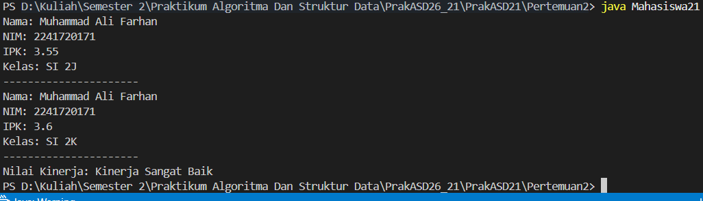

# PrakASD21
Praktikum Algoritma Dan Struktur Data
|--|--|
| NIM |  254107020237|
| Nama |  Muhammad Akbar Raffi Putra Susanto  |
| Kelas | TI - 1F |
| Repository | [link] https://github.com/254107020237-crypto/PrakASD21

# Jobsheet 1 OBJECT

## 2.1 Deklarasi Class, Atribut dan Method
    ## 2.1.2 Hasil Percobaan

## 2.1.3 Pertanyaan
    1. Dua karakteristik class atau object?
        Class atau object memiliki dua karakteristik utama yaitu atribut dan method.
    2. Ada berapa atribut yang dimiliki oleh class Mahasiswa?
        Pada class Mahasiswa memiliki 4 atribut yaitu String nama; String nim; String kelas; double ipk;
    3. Ada berapa method yang dimiliki oleh class tersebut?
        Ada 4 method, yaitu tampilkanInformasi(): void; ubahKelas(kelasBaru: String): void; updateIpk(ipkBaru: double): void; nilaiKinerja(ipk: double): String Modifikasi kode program.

    5. Jelaskan bagaimana cara kerja method nilaiKinerja()?
        method nilaiKinerja() bekerja dengan cara mengecek kondisi nilai IPK (>= 3.5 kinerja sangat baik, >=3.0 kinerja baik, >=2.0 kinerja cukup, dan <2.0 kinerja kurang). Method nilaiKinerja() mengembalikan nilai bertipe String berupa kategori kinerja mahasiswa.
